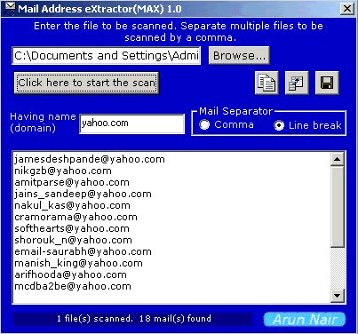



## MAX 1\.0

### Description

How many times have you wanted to extract email addresses from text files/html files/document files ..or for that matter any file but gave up because of the task involved??

Look no further,

This application extracts email ids from any applications with amazing speeds. This application uses intelligent email scan algorithms which can recognise a true email address from the rest. Besides, you can also save the extracted emails into text/html or directly into the Outlook CSV format!(so all you have to do is import it from Outlook Express and add it directly to your address book!!). Even the speed of extraction is amazing. Other features include domain filtering, multiple file parsing.
 
### More Info
 
This application takes in any readable file(txt/doc/html/eml etc.) as the input. No command line parameters involved.

The programmer/developer glancing through the code should have basic knowledge of using VB ...besides certain controls. If you encounter any problem in interpreting the code, please let me know.

Extracts email addresses using intelligent scanning algorithms out of any readable file.

No side effects completely safe since last tested(unless of course, somebody makes changes to the code after downloading and makes it detrimental!!)

             |
---                |---
**Submitted On**   |2000-12-11 17:02:48
**By**             |[Arun Nair](https://github.com/Planet-Source-Code/PSCIndex/blob/master/ByAuthor/arun-nair.md)
**Level**          |Intermediate
**User Rating**    |4.9 (34 globes from 7 users)
**Compatibility**  |VB 5\.0, VB 6\.0
**Category**       |[Complete Applications](https://github.com/Planet-Source-Code/PSCIndex/blob/master/ByCategory/complete-applications__1-27.md)
**World**          |[Visual Basic](https://github.com/Planet-Source-Code/PSCIndex/blob/master/ByWorld/visual-basic.md)
**Archive File**   |[CODE\_UPLOAD1257812112000\.zip](https://github.com/Planet-Source-Code/arun-nair-max-1-0__1-13507/archive/master.zip)

